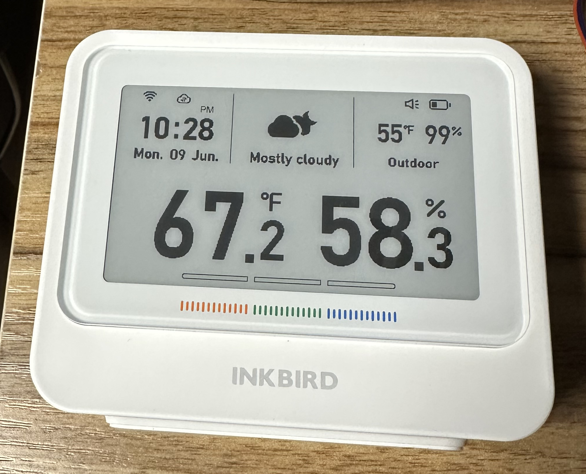
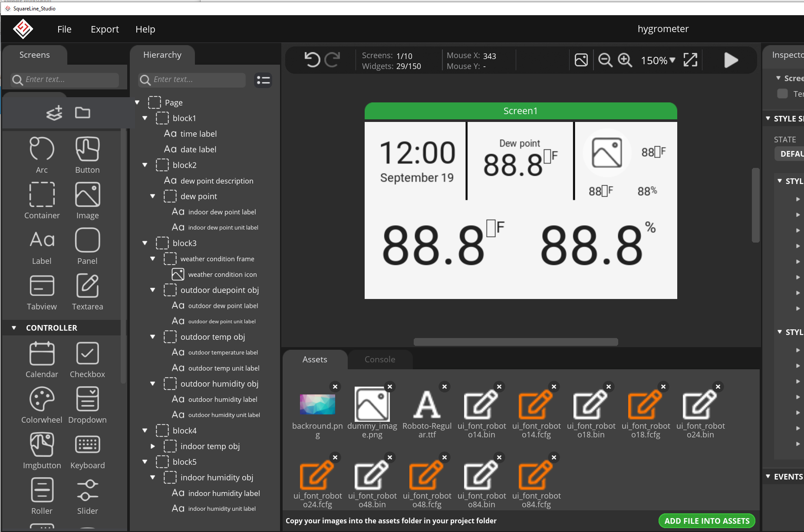
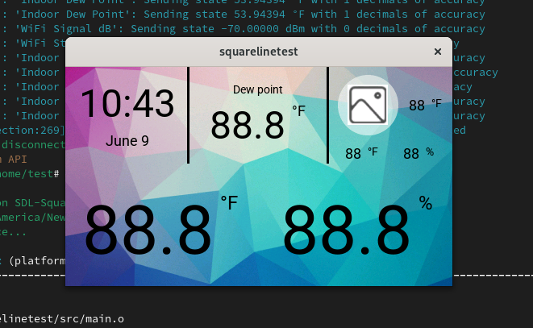

I built this using SquareLine Studio and the SquareLine to ESPHome converter. It was a fast build due the the simplicty of Squarline Studio.

## Install and build

Step one is to create a secrets.yaml. This is what mine looks like 

```
wifi_ssid: "FBIvan05"
wifi_password: "VerySeceret!"
latitude: 38.897957
longitude: -77.036560
```

Next install the Squareline to ESPhome libary, the LVGL ESPhome libary and the libary for this screen.

```
git clone https://github.com/gpambrozio/SquarelineToEsphome.git
git clone https://github.com/agillis/esphome-modular-lvgl-buttons.git
git clone https://github.com/agillis/esphome-hygrometer.git
uv run ./SquarelineToEsphome/squareline_to_esphome ./esphome-hygrometer/Squareline_files/hygrometer/hydro.spj -o ./squareline_generated.yaml
```

You can test your code using SDL on a PC or mac. Lot of info in that here https://esphome.io/components/display/sdl.html

```
cp esphome-hygrometer/SDL-SquarelineToEsphome-base.yaml .
esphome run SDL-SquarelineToEsphome-base.yaml
```

After you get it working install to a hardware screen. I used a guition jc4827w543. This is not the best screen I have worked with. It only has 4mb ot RAM so ESPHome can only use 2mb (you need to save half for OTA updates. But with some very optimized code I got LVGL working and also an i2c temperature sensor + relitive humidity. This screen does have an a Qwiic connector so you can add Qwiic I2c devices with no soldering.

```
cp esphome-hygrometer/guition-esp32-jc4827w543-SquarelineToEsphome-base.yaml .
esphome run guition-esp32-jc4827w543-SquarelineToEsphome-base.yaml
```

## History

This demo is based on a commercial screen that I like the look of.



I recreated it in Squareline. It was very easy. I can set most of the objects to layout type flex so everything sort of floats to the right place. NO pixel counting!!



I use SDL to test my design on a PC or MAC. I’m planning to use a color screen so I added a color background.



Then I loaded it to a Guition jc4827w543 ($20 USD). I attached a very accurate humidity + temp sensor so I can get local values. I also used Accuweather to get today outdoor weather+ Due Point.


I’m very interested in the dew point. An indoor due point of greater then 55 degrees F will cause mold. So I want to run my dehumidifier at that point.
